# 🔍 Obscura – Digitale Dokumentation von Baugruppen mit Bilderkennung

**Obscura** ist eine Softwarelösung zur automatisierten Erfassung, Erkennung und Dokumentation von Baugruppen (z. B. im Stellwerkschrank) mithilfe von KI-gestützter Bilderkennung. Ziel ist es, QR-Codes, Artikelnummern und weitere Informationen auf Fotos automatisch zuzuordnen und die Daten für SAP-kompatible Exporte aufzubereiten.

---

## 🎯 Projektziele

- Unterstützung der DB InfraGO AG bei der digitalen Bestandsaufnahme
- Automatisierte Bilderkennung von Komponenten, QR-Codes und Artikelnummern
- Möglichkeit zur manuellen Korrektur und Fehlerhinweis bei Unschärfe
- Export der Ergebnisse in strukturierter Excel-Form für SAP
- Intuitive Benutzeroberfläche über PowerApps + Python-Backend

---

## 🔧 Setup & Konfiguration

### 🖼️ Frontend (Power Apps)

Für die Ausführung der Power Apps Benutzeroberfläche:

1. Die bereitgestellte **"GUI_final.zip" ZIP-Datei herunterladen**  
2. In [Microsoft Power Apps Studio](https://make.powerapps.com/environments/Default-071a88fe-ae7e-42b8-9ab0-3c7eb5776919/apps) anmelden  
   *(das Konto muss Zugriff auf PowerApps haben)*  

---

#### ❗ Vor dem Import: Gmail-Verbindung einrichten

- Links im Menü auf **Mehr** > **Verbindungen** klicken  
  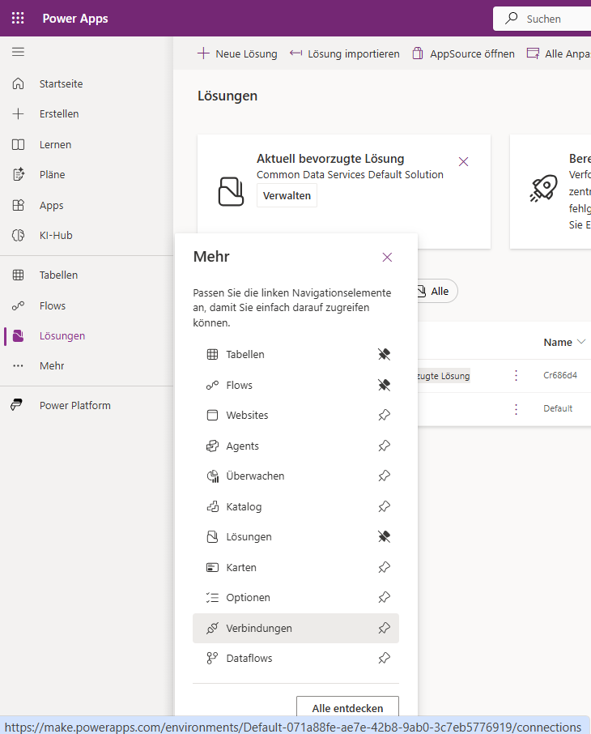

- **Neue Verbindung** anklicken  
  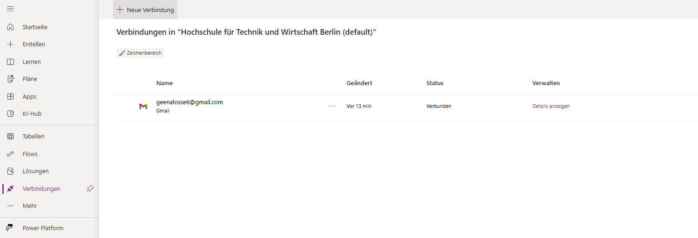

- Bei der Suche oben rechts „gmail“ eingeben  
  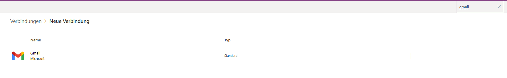

- **Gmail** auswählen  
  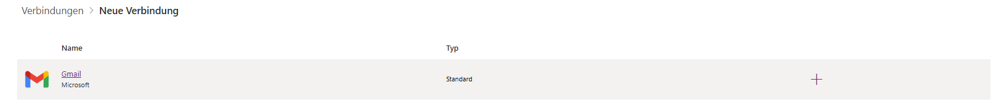

- Auf **Akzeptieren und erstellen** klicken  
  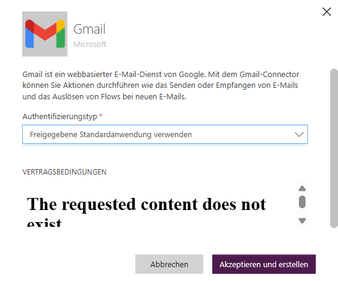

- Bei Weiterleitung mit eigener Gmail-Adresse anmelden und Zugriff bestätigen  

---

3. Links im Menü auf **Apps** klicken  
   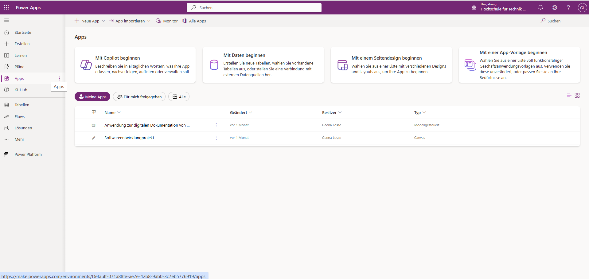

4. Auf **App importieren** klicken und **aus Paket (.zip)** auswählen  
   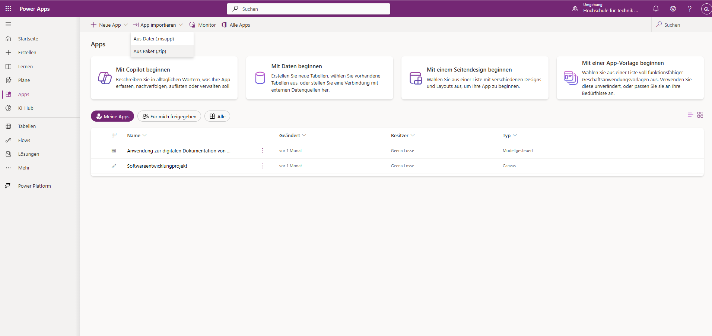

5. Auf **Hochladen** klicken und heruntergeladene „GUI_final“ ZIP-Datei auswählen  
   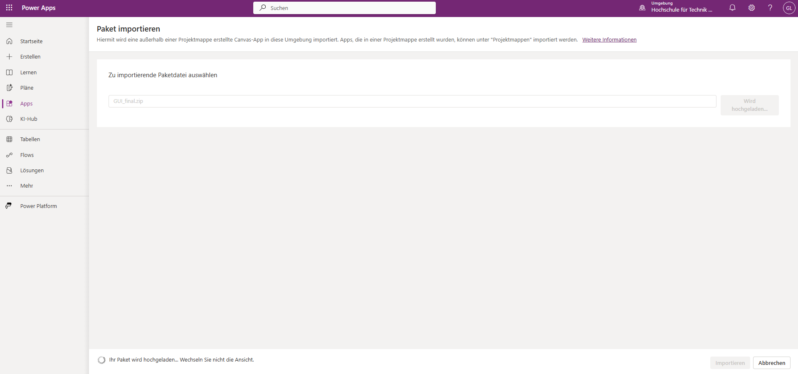

6. Überprüfen, ob die Dateien richtig hochgeladen wurden. Falls dieses rote Symbol erscheint:  
   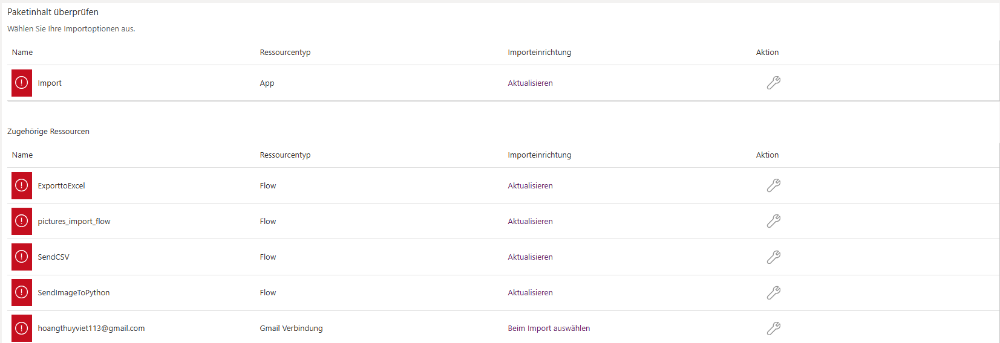

   - Klicken Sie auf das Symbol bei der rot markierten Datei  
     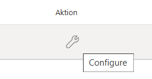  
   - Stellen Sie in der **Importeinrichtung** das **Setup** auf **Als neu erstellen**  
     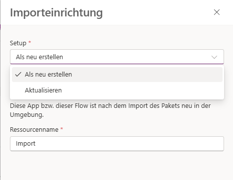  
   - Änderungen mit **Speichern** bestätigen  
   - Diesen Vorgang ggf. für alle rot markierten Dateien wiederholen  

7. Für die **Gmail-Verbindung**:  
   - Auf das Symbol klicken  
     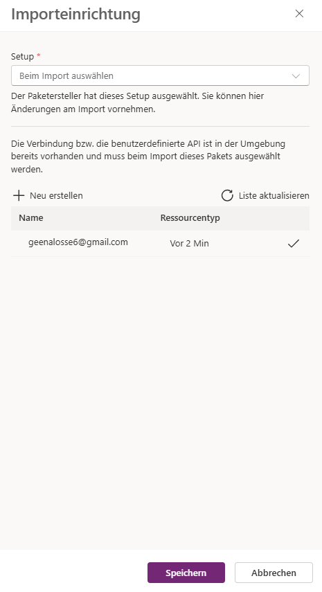  
   - Die vorher erstellte Gmail-Verbindung auswählen  
   - Änderungen mit **Speichern** bestätigen  

8. Wenn alle Dateien bereit sind, auf **Importieren** klicken  
   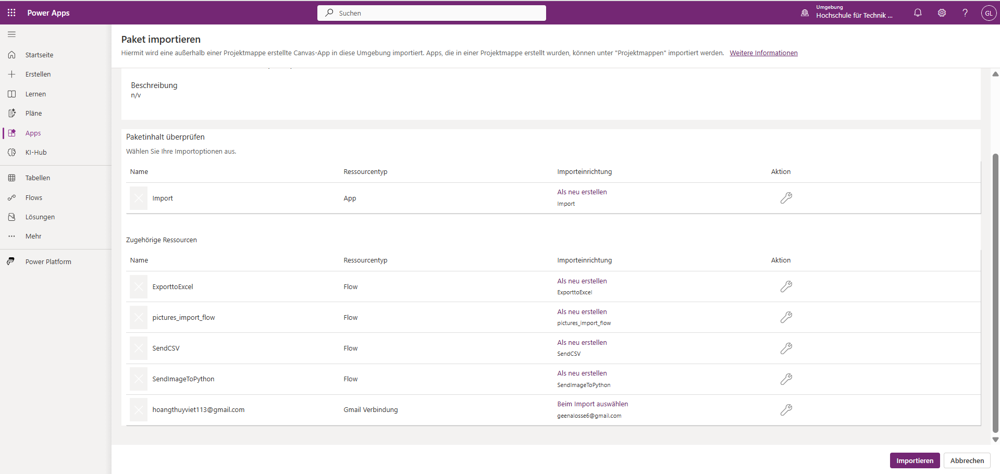  
   - Bei erfolgreichem Import sollte es so aussehen:  
     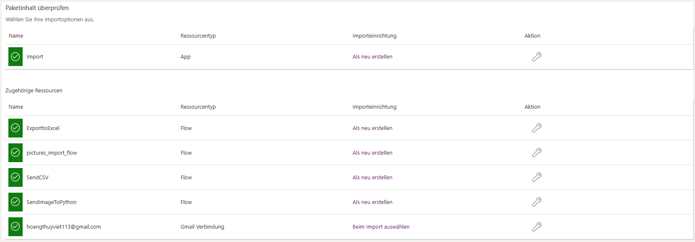

9. Überprüfen, ob die Flows aktiviert sind:  
   - Klicken Sie links im Menü auf **Flows**  
     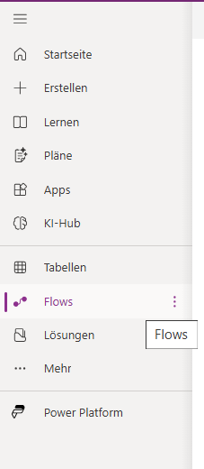  
   - Wenn der Flow so angezeigt wird, ist er deaktiviert:  
     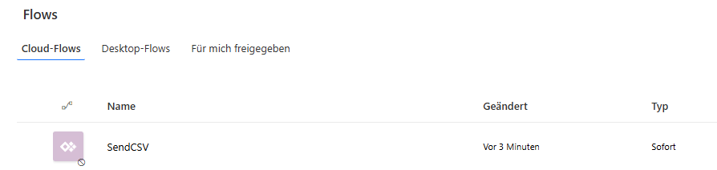  
   - Klicken Sie auf die **drei Punkte** beim Flow und drücken Sie dann auf **Aktivieren**  
     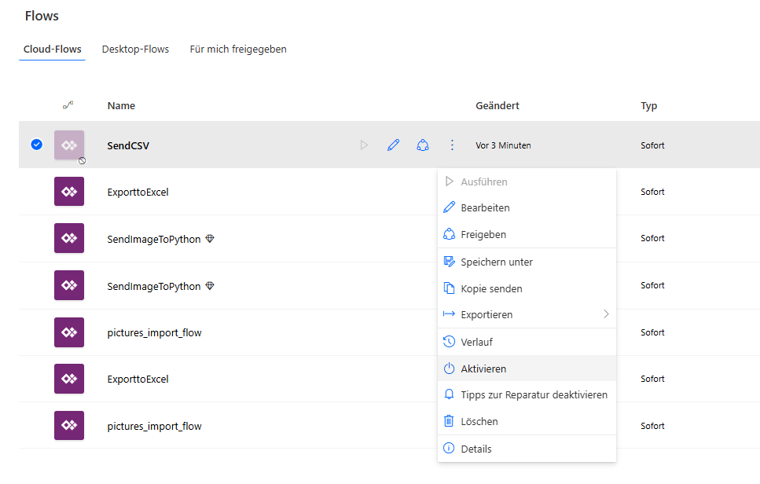  
   - Die aktivierten Flows sollten dann so angezeigt werden:  
     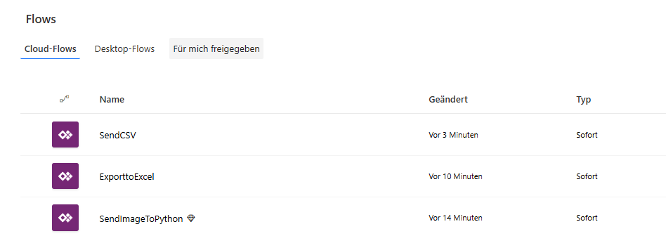

10. Nach dem Import und der Aktivierung unter **Apps** die Anwendung auswählen und mit dem **Dreieck-Button (▶️)** starten  
   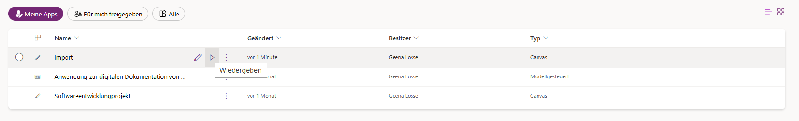


### 📦 Backend (Bilderkennung & Schnittstelle)

Das Backend besteht aus mehreren Modulen zur **Bilderkennung** sowie einer **Schnittstelle**, um Ergebnisse an Power Automate / Power Apps zu senden.

Die Skripte wurden über **Visual Studio Code** ausgeführt. Modelle & Erkennung laufen lokal in Python, Anfragen werden via FastAPI entgegengenommen.

---

#### ! Für die Verbindung zur Power App über HTTP-Endpoint herstellen

1. ngrok herunterladen

- Gehe zu [https://ngrok.com/download](https://ngrok.com/download)
- Lade die Windows-Version herunter
- Entpacke die Datei (z. B. in deinen `Downloads`-Ordner)
- Merke dir den Pfad zur Datei `ngrok.exe` – dieser wird in Schritt 5 benötigt


2. Bei ngrok registrieren

- Öffne [https://ngrok.com/signup](https://ngrok.com/signup)
- Erstelle einen kostenlosen Account
- Gehe danach zu [https://dashboard.ngrok.com/get-started/setup](https://dashboard.ngrok.com/get-started/setup)
- Kopiere deinen **Auth Token**  

3. Token im Terminal hinterlegen (Nur beim ersten Mal notwendigS)

- Öffne das Terminal im Projektverzeichnis und führe aus:
```bash
ngrok config add-authtoken DEIN_TOKEN_HIER
```

4. Lokalen Server starten
- Öffne das Terminal und wechsle ins Projektverzeichnis:
  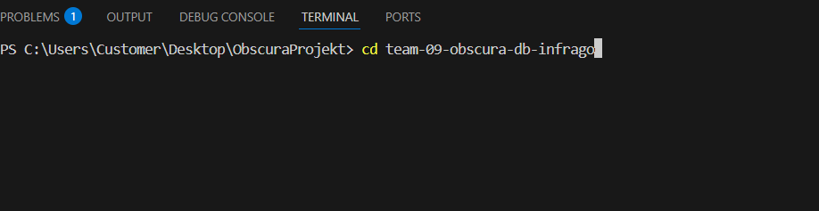

- Starte dann das Backend mit FastAPI:
  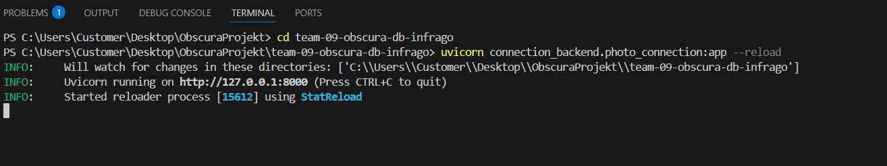

5. ngrok starten
- Öffne ein zweites Terminal und führe aus:
  → Nutze den vollständigen Pfad zur Datei ngrok.exe, wo du sie entpackt hast 
- (Beispiel)
  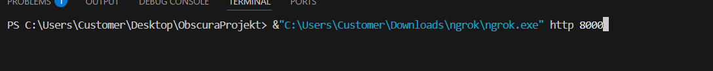

- Die Konsole zeigt eine URL wie:
  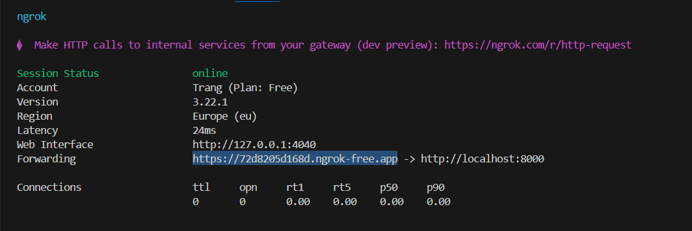

6. HTTP-URL im bestehenden Flow anpassen
- Gehe zu [https://make.powerautomate.com](https://make.powerautomate.com)

- Öffne SendImageToPython Flow (Klicke auf **Drei Punkte (⋯)** neben der App und wähle **„Bearbeiten“**)
  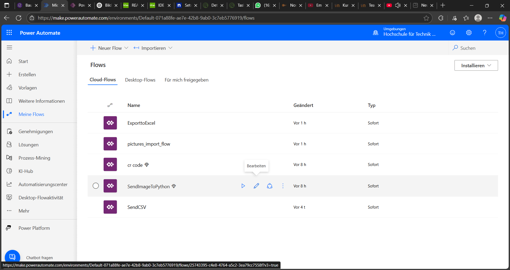

- Klicke auf den **HTTP-Block**
  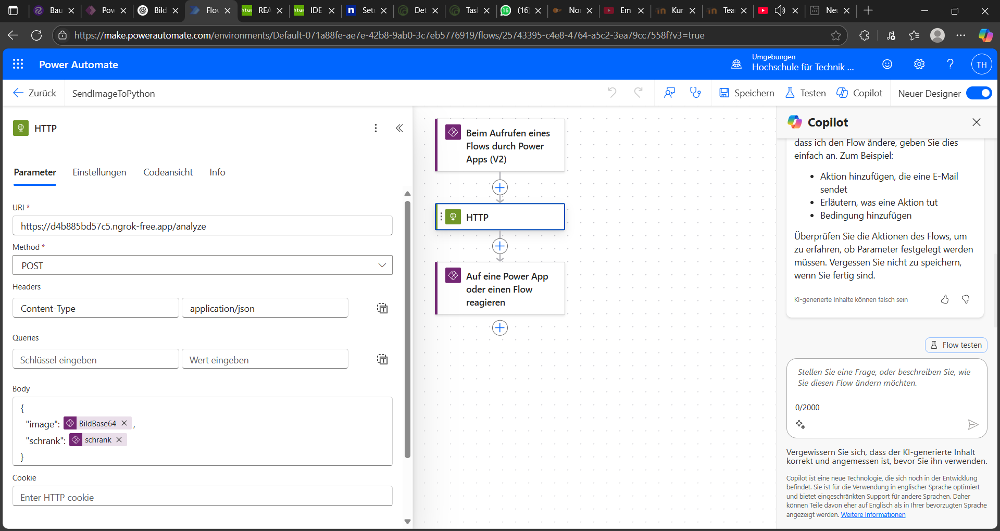

Ersetze die bestehende URL z. B.:

  Von:
  ```
  https://dein-alter-url.ngrok-free.app/process
  ```
  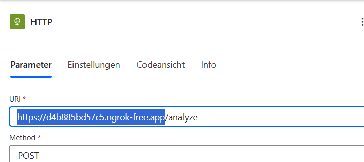
  Nach:
  ```
  https://dein-neuer-url.ngrok-free.app/process
  ```
  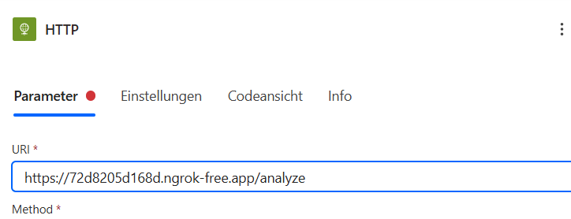

- Klicke oben rechts auf **Speichern**
  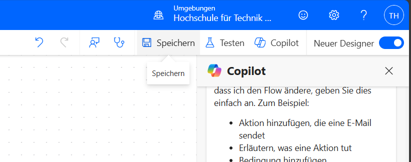

- Ignorieren die Warnung
  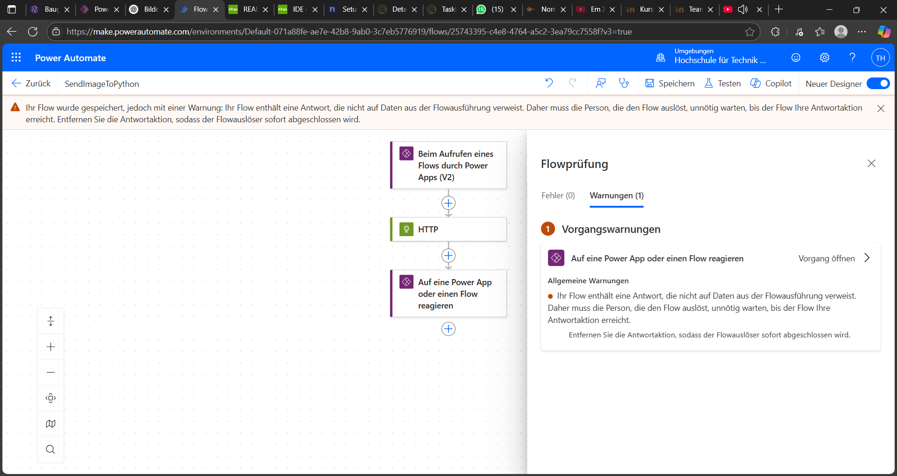

7. Flow-Verbindung in Power Apps aktualisieren
- Gehe zurück zum Power Apps 

- In der **Strukturansicht** links:
    - Klicke auf die **drei Punkte (⋯)** 
    - Wähle **„Power Automate“** aus dem Menü
  

- Suche nach deinem Flow SendImageToPython in der Liste
- Klicke auf das **drei Punkte (⋯)** und dann (Aktualisieren), um die neue Version des Flows mit der geänderten URL zu laden
  

Jetzt ist die Verbindung vollständig eingerichtet – Sie können in der Power App ein Bild hochladen und siehst das Ergebnis direkt im **Terminal**, in dem `uvicorn` läuft.

---


## ⚙️ Tech Stack

| Ebene         | Technologie                |
|---------------|----------------------------|
| Oberfläche    | Microsoft PowerApps         |
| Logik         | Python (Roboflow) |
| Export        | Python (Power Automate) |
| Versionierung | Git / GitLab                |
| Lizenz        | MIT License                 |

---

## 🧪 Funktionale Bestandteile

- 📸 **Fotoimport**  

- 🧠 **KI-gestützte Bilderkennung & Zuordnung**  
  - **Artikelnummern-Erkennung**   
  - **Barcode-Erkennung** 
  - **Baugruppenbezeichnung-Erkennung** 
  - Automatische Zuordnung: `QR-Code ⇔ Artikelnummer ⇔ Baugruppename`

- 🔄 **Backend-Logik zur Verknüpfung & Analyse**  
  - Bildübergabe an die KI  
  - Anbindung von Power Apps an Python-Server (FastAPI, Ngrok)
  - Bilderkennung mit Roboflow trainieren

- 🧑‍💻 **Frontend (Power Apps)**  
  - Nutzeroberfläche zur Aufnahme, Anzeige und Auswahl der Ergebnisse  
  - Steuerung der Analyseprozesse & Export-Trigger

- 📤 **Exportfunktion**  
  - Ausgabe der Ergebnisse als `.csv`-Datei zur Weiterverarbeitung (z. B. SAP)

---

## 📁 Projektstruktur 

```bash
team-09-obscura-db-infrago/
│
├── 📂 qr_code_erkennung/                     # Main directory for classic image processing
│   ├── main.py                               # Combined test runner
│   ├── qr_code_api.py       
│   ├── qr_code_auslese.py       
│   ├── objekt_finder.py                      # Object detection preprocessing
│   ├── tester.py                             # Testing logic
│   ├── winkel_ausgleich.py                   # Orientation correction
│   └── 📂 Dokumentation Versuche/            # Test logs
│       └── Testübersicht barcode erkennung.txt
│
├── 📂 article_number/                       # Roboflow article number recognition
│   ├── article_number.py                    # Standalone OCR script
│   ├── article_number_ocr_api.py            # FastAPI interface
│   ├── article_number_ocr_utils.py          # OCR helper functions
│   ├── run_roboflow_test.py                 # Roboflow + OCR test script
│   └── 📂 Artikelnummererkennung.v6i.yolov5pytorch/
│       ├── download_model.py
│       ├── data.yaml
│       ├── README.dataset.txt
│       ├── README.roboflow.txt
│       ├── 📂 train/valid/test             # Dataset structure for Roboflow model
│
├── 📂 baugruppen_label_recognition/        # Roboflow model for Baugruppenbeschriftung
│   ├── baugruppen_detector.py
│   └── 📂 Baugruppen_labels.v7i/
│       ├── data.yaml
│       ├── README.dataset.txt
│       ├── README.roboflow.txt
│       ├── 📂 train/valid/test
│
├── 📂 connection_backend/                  # Central backend logic
│   ├── photo_connection.py                 # Entry point to call Roboflow models
│   └── requirements.txt                    # Dependencies for FastAPI backend
│
├── 📂 ReadMe_pictures/                    # Screenshots for documentation
│   └── image-1.png ... image-xx.png
│
├── 📂 GUI_final.ZIP                       # PowerApps application frontend

├── 📄 README.md                           # Project documentation
├── 📄 LICENSE                             # License information
├── 📄 .gitignore                          # Git exclusions
└── ngrok.exe                              

